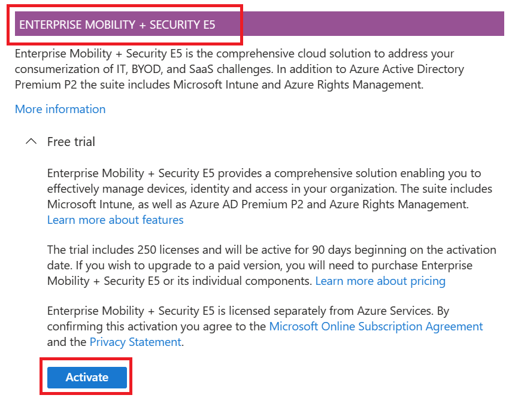
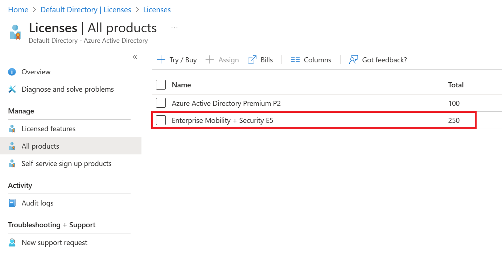
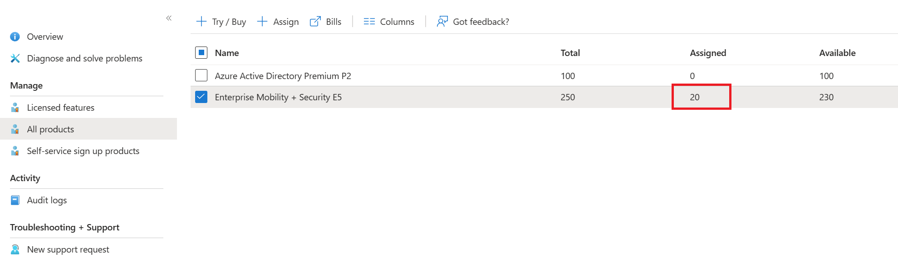

# Deploy the environment for the Hands On Lab

## Getting Started

### Azure Subscription requirements

Verify that your subscription has a Azure AD (Microsoft Entra ID now) Premium P2 if not just use the trial one like this:
Go to `Azure Active Directory` > `Licenses` > `Overview`. In the top right under `Quick tasks` select `Get a free trial`. Select Azure AD Premium P2 and select Activate.

Logout and login again to the Azure portal to see the new Licence activated.

Register the `Microsoft.Web` provider to be able to create Azure Deployment Environments with Azure Application Web Apps.

You need to enable intune for the subscription to be able to use Dev Box. In fact, your Dev Boxes are linked to intune behind the scene. To do that just add a `Enterprise Mobility + Security E5` licence in your Subscription.
To do this, go to `Azure Active Directory` > `Licenses` > `All products`. Click on `Try / Buy` and click on `Activate` for the `Enterprise Mobility + Security E5` licence.



If everything is ok, you should see the `Enterprise Mobility + Security E5` licence in the list of licences.



Ask for a Dev Box quota increase to be able to create Dev Boxes, by default only 2 will be allowed for Azure Pass subscriptions.

Select the checkbox on the `Enterprise Mobility + Security E5` line and click `Assign`, then select your user group and click `Review + assign`.

After a few minutes you should see the assignment column updated:



### Update naming

Fork this repository to your GitHub account and clone it to your local machine. Go to the `src` folder and find the `main.json` inside `parameters` folder. 

Update the `resourceNaming` object to fit your needs. The `resourceNaming` object is used to generate unique names for the resources that will be deployed to your Azure subscription. You can just change the `resource suffix` number and the `owner` property of this object. **Use only lowercase**.

## Deploy the Dev Center

Log in to your Azure subscription:

```bash
az login
# Select the subscription to use
az account set -s <your-subscription-id>
```

Next, create a GitHub [personal access token](https://docs.github.com/en/github/authenticating-to-github/creating-a-personal-access-token) with the `repo` scope. This will be used to get the template code from GitHub repositories for the Dev Center catalog.

Save this token in a GitHub secret called `GH_PAT`.

Run the next command to deploy the resources to your Azure subscription:

```bash
az deployment sub create --location westeurope \
                         --template-file infra-starter/src/bicep-devcenter/main.bicep \
                         --parameters @infra-starter/src/bicep-devcenter/parameters/main.json \
                         githubPat=$GH_PAT
```             

## Populate the subscription with default users

If you use an SPN to deploy, this resource requires one of the following application roles: `Group.ReadWrite.All` or `Directory.ReadWrite.All`.

If you use a user account to deploy, this resource requires one of the following directory roles: Groups Administrator, User Administrator or Global Administrator.

```bash
az login --allow-no-subscriptions --tenant <tenant-id>
```

```bash
cd infra-starter/src/terraform-azure-ad/
terraform init
```

```bash
terraform plan -var domain_name=<domain-name> -var user_group_name=<user_group_name> -var user_default_password=<user_default_password> -out plan.out
```

```bash
terraform apply plan.out
```

## Link the DevCenter and the user group

Go to the Azure portal and navigate to the Project associated to your Dev Center. Select Access Control (IAM), add the `DevCenter Dev Box User` and  `Deployment Environments User` role to the user group.

